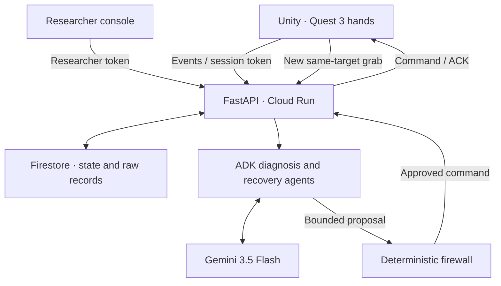

# ProtocolRun-VR

Autonomous operations for a three-cube VR hand interaction study: observe a real interaction failure, diagnose it with Google ADK + Gemini, restore only the approved baseline and verify recovery with a new grab of the same object.

**0.4.0 RC2 is an integration candidate, not a verified final submission.** The application has no simulated AI fallback or fake dashboard metrics. Automated tests use explicitly identified fixtures. Real Unity compilation, Quest hardware, Gemini credentials and Google Cloud deployment must pass the acceptance checklist.

## Start here

- Korean step-by-step installation: [docs/START_HERE_KO.md](docs/START_HERE_KO.md)
- API / security / recovery contract: [docs/API_CONTRACT.md](docs/API_CONTRACT.md)
- Submission and real-world acceptance: [docs/SUBMISSION.md](docs/SUBMISSION.md)
- Current Unity Meta SDK: [unity-meta/README_KO.md](unity-meta/README_KO.md)

## Project layout

| Directory | Purpose |
|---|---|
| `backend/` | Standalone FastAPI server, English console, Google ADK agents, protocol firewall, persistent stores, Dockerfile and tests |
| `unity-meta/` | Meta hand tracking SDK, local guarded actuator, HTTP client, offline queue, HUD and installer |
| `unity-project/` | User's supplied Unity Assets/Packages/ProjectSettings with this SDK; original scene layout retained |
| `app/` | Optional separate Korean React researcher dashboard |
| `deploy/` | Cloud Run deployment and model/server checks |
| `docs/` | Setup, security, acceptance and submission instructions |
| `unity/` | Legacy XRI controller adapter; do not import into the Meta scene |

The server is an independently runnable submission component. Spring is not required. The bundled English `/console/` works without ChatGPT or Sites; it requires the researcher token to access study data.

## Architecture



A and B must first be grabbed and released normally. A remains healthy. The researcher deliberately disables B's captured direct HandGrab/Grab paths. C is intentionally non-grabbable and cannot be repaired into a grabbable object. Gemini reads actual tracking, pinch, component and interaction evidence. Only approved original component states may be restored. A restore ACK alone cannot pass verification.

## Run the standalone server locally

On Windows, double-click `RUN_LOCAL_WINDOWS.bat`. On macOS/Linux, run `./RUN_LOCAL_MAC_LINUX.sh`. The launcher creates the Python environment, installs the pinned server dependencies, starts the server and opens the console.

Python 3.12:

```bash
cd backend
python3.12 -m venv .venv
.venv/bin/pip install -r requirements-dev.txt
.venv/bin/python run_local.py
```

On Windows use `py -3.12`, then `.venv\Scripts\python.exe` instead of `.venv/bin/python`. The launcher generates `backend/.env.local` with a private random researcher token. Open `http://127.0.0.1:8080/console/` and copy that token privately into the console. Never commit or record it.

Local sessions and storage do not require Google credentials. Actual Gemini diagnosis/report generation does. For login-free local testing, put a Google AI Studio `GOOGLE_API_KEY` only in `backend/.env.local`; for Vertex AI, authenticate with `gcloud auth application-default login` and set `GOOGLE_CLOUD_PROJECT` there instead. Never commit that private file. Model failures are recorded and never replaced with fake successful recovery.

For a local container, copy/edit `backend/.env.example` to `backend/.env`, use a random researcher token and run `docker compose up --build`. Its data volume is durable locally. For Vertex AI inside Docker, explicitly supply ADC using a private read-only credential mount at your discretion; host credentials are not automatically available in the container. Never include credential files in the image. Docker execution has not been verified in this build environment.

## Deploy to Google Cloud

In your authenticated Cloud Shell, from the project root:

```bash
bash deploy/deploy_gcp.sh YOUR_ACTUAL_PROJECT_ID
```

The script asks for `DEPLOY` before creating billable resources or IAM bindings. It deploys a standalone `/console/`, creates scoped runtime/build identities, configures Firestore and Secret Manager, and uses the runtime service account for Vertex AI. It does not create service-account JSON keys or delete other projects/services.

The endpoint is publicly reachable, but study routes require application bearer tokens. This is a single-researcher demo authorization model, not a multi-tenant production system. `/healthz` and console assets do not expose study data. Instance limits are not spending caps.

To also allow the optional external Korean dashboard, pass its exact HTTPS origin as the second argument. A dashboard preview does not prove Google Cloud backend deployment.

## Unity integration

Target versions from the supplied project: Unity **6000.3.16f1**, Meta XR All-in-One **205.0.0**, OpenXR **1.16.1**, Quest 3 PCVR Link, **hand tracking**.

1. Import only `unity-meta/Assets/ProtocolRunVRMeta`, preserving `.meta` files. Existing scene components retain their GUIDs.
2. Run `Tools > ProtocolRun VR > Install Network Study`; save the scene. Check Head, IHand sources and drop volume.
3. In the server console, create a `meta-hands-v1` session and copy Connection JSON.
4. Paste it into `Tools > ProtocolRun VR > Configure Connection`. It is stored outside the Unity project.
5. Enter Play, accept consent in VR, then grab/release A and B for practice.
6. In target-approach/grab phase, with hands away from B, the researcher injects B's deliberate fault through the Session Inspector.
7. Make three distinct near-B pinch attempts. Wait for actual Gemini/firewall/restore/ACK processing; do not manually restore.
8. Perform a fresh B grab, place it in the drop zone, choose difficulty and submit. Keep Play running until the report is generated.

A new Play run requires a new server session. Pending data are replayed on network reconnection within the same run; app-restart resumption is deliberately blocked to avoid applying stale physical-state commands. Full local JSONL and server raw logs remain available.

The default HUD appears once in front of the tracked HMD. Its reachability/readability and index-fingertip pinch controls require hardware testing; position it appropriately before recording.

## Verification

```bash
# Python environment has backend requirements-dev.txt installed
PYTHONPATH=backend pytest backend/tests -q
# Optional separate dashboard, Linux/WSL and Node 22.13+
npm ci
npx tsc --noEmit -p tsconfig.dashboard.json
npm run build
node --test tests/*.test.mjs
python deploy/verify_unity_source.py
```

Automated tests cover both adapters, consent, immutable baselines, C protection, unique pinch attempts, model failure, firewall denials, expired commands, bad ACKs, fresh retest identity, raw exports and console authentication. C# has syntax validation and a Unity Editor policy-check menu; syntax parsing does not establish Unity compilation or SDK lifecycle correctness.

The dependency-pinned ADK `SequentialAgent` emits a deprecation warning; migration to its successor is separate work. Backend tick work is awaited by Unity and does not depend on an open researcher dashboard. There is no independent Pub/Sub/Cloud Tasks worker in this release.

## Limits and research integrity

This is one bounded demonstration, not validated unattended human-subject research. Pinch + index-fingertip proximity is an attempt heuristic, not a universal grasp-intent detector. Pose telemetry is 1 Hz; FPS is an instantaneous sample. No audio/video, continuous motion replay, arbitrary protocol DSL, PDF report, unrestricted code generation, multi-user authorization or statistically validated outcomes are claimed.

Original logs are retained and interruption/retest intervals are marked for exclusion. Elapsed times include interruptions/network delay. Local and server guards stop on unrecognized state, credentials failure, expired commands, changed identities or insufficient evidence. C is never given grab components.

## Sources and third-party software

- [Hackathon rules](https://allthingsagentichackathon.devpost.com/rules)
- [Google ADK](https://adk.dev/agents/workflow-agents/sequential-agents/)
- [Gemini 3.5 Flash](https://docs.cloud.google.com/gemini-enterprise-agent-platform/models/gemini/3-5-flash)
- [Cloud Run source deployment](https://docs.cloud.google.com/run/docs/deploying-source-code)
- [Meta IHand v205](https://developers.meta.com/horizon/reference/interaction/v205/interface_oculus_interaction_input_i_hand/)

Google's libraries are used to build this system; Google does not provide a turnkey ProtocolRun-VR implementation. Retain dependency and asset licenses when distributing. No user GitHub repository or actual GCP deployment has been created by merely packaging this release.
