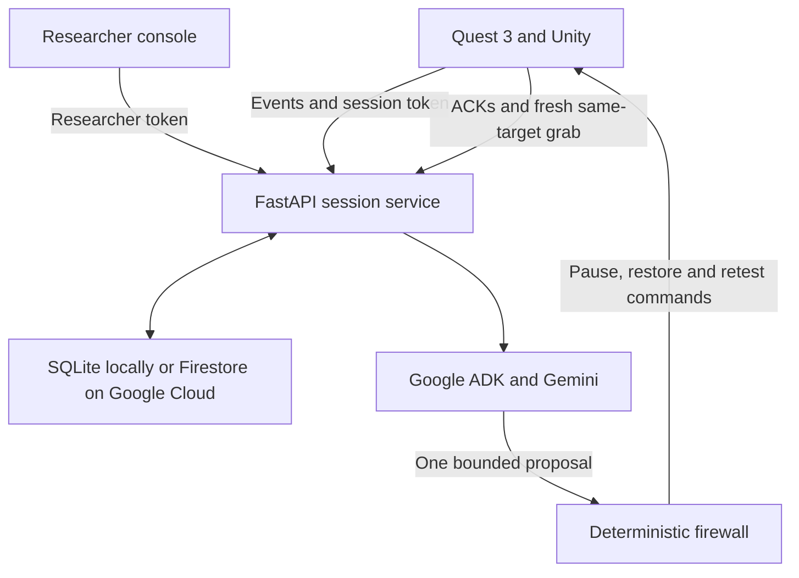

# ProtocolRun-VR

ProtocolRun-VR is a policy-constrained agent for a Meta Quest hand-interaction study. It detects a verified interaction failure, requests one bounded recovery proposal from Google ADK + Gemini, applies a deterministic safety firewall, restores only the approved target's captured baseline, and requires a new same-object hand grab before declaring recovery successful.

This project was prepared for the **All Things Agentic Hackathon** in the **Taskmaster** category.

Repository: https://github.com/Moonsu-11/ProtocolRun-VR

## Problem

A technical failure during a VR study can silently invalidate task timing, participant responses, and interaction data.

Automatically changing a Unity scene based only on unrestricted model output would introduce a second problem: an AI-generated action could modify the wrong object, use stale evidence, alter protected components, or incorrectly claim that recovery succeeded.

ProtocolRun-VR addresses both problems by separating AI reasoning from execution authority.

- Gemini inspects a compact set of server-verified evidence.
- Google ADK constrains the model to one recovery proposal tool.
- A deterministic server firewall independently validates the proposal.
- A local Unity actuator restores only a previously captured component baseline.
- A fresh physical interaction is required to prove recovery.
- Original failure data remain in the audit trail.

## Demonstrated workflow

The recorded Quest run demonstrates the following local end-to-end workflow:

1. The participant accepts the study consent prompt.
2. Unity registers immutable healthy baselines for CUBE_A, CUBE_B, and CUBE_C.
3. CUBE_A is successfully grabbed and released as the normal practice object.
4. The protocol-controlled demo fault disables CUBE_B's captured direct hand-grab paths.
5. Three distinct near-target pinch attempts generate matching `grab_attempt` and `grab_failed` evidence.
6. A real Google ADK agent calls Gemini 3.5 Flash.
7. Gemini calls the bounded `propose_recovery` tool.
8. The deterministic firewall independently verifies the evidence and permitted action.
9. The server issues pause, baseline restoration, and retest commands.
10. Unity validates and acknowledges each command.
11. A new SDK-observed CUBE_B hand grab verifies recovery.
12. The participant places CUBE_B in the drop zone and submits the survey.
13. The server retains the interruption segment, verification result, command acknowledgements, raw events, and audit records.

The recorded recovery cycle used a local FastAPI server with SQLite and a private Google AI Studio API key. It did not use a simulated model response or a fake success fallback.

## Verification status

| Capability | Evidence | Status |
|---|---|---|
| Unity 6000.3.16f1 project | Project and scene included in the repository | Included |
| Meta Quest 3 hand tracking | Recorded hardware demonstration | Verified in the recorded run |
| CUBE_A normal interaction | New SDK-observed grab and release | Verified in the recorded run |
| CUBE_B controlled failure | Captured direct grab paths disabled before participant interaction | Verified in the recorded run |
| Three independent failure attempts | Distinct attempt IDs and matching failure events | Verified in the recorded run |
| Google ADK | Real `propose_recovery` function call | Verified locally |
| Gemini 3.5 Flash | Private Google AI Studio API-key call | Verified locally |
| Deterministic firewall | Server audit records and automated tests | Verified |
| Guarded Unity restoration | Baseline ID, run ID, phase and release-state checks | Verified in the recorded run |
| Fresh same-object retest | New CUBE_B `HandGrab` selection after acknowledged restoration | Verified in the recorded run |
| Local persistence | `SQLiteStore` with raw events and audit records | Verified locally |
| Cloud Run deployment | Revision `protocolrun-vr-00001-xhf`, `Ready`, 100% traffic in `us-central1` | Deployment and container startup verified |
| Cloud Run container runtime | `Application startup complete` and Uvicorn listening on port 8080 | Verified in Cloud Run logs |
| Firestore | Default Firestore Native database provisioned in `us-central1` | Provisioning verified |
| Cloud runtime configuration | Firestore and Vertex AI environment/service-account configuration in deployment script | Configured |
| Public Cloud Run endpoint | Google frontend returned HTTP 404 during final endpoint checks | Not verified |
| Quest-to-Cloud Run recovery cycle | No remote hardware cycle was recorded | Not claimed |
| Vertex AI call from Cloud Run | No successful Cloud Run model invocation was recorded | Not claimed |

The Google Cloud deployment evidence establishes that the backend container was built, deployed, started, and routed to an active Cloud Run revision, and that a Firestore Native database was provisioned.

It does not establish a successful public `run.app` request, Firestore application transaction, Vertex AI call from Cloud Run, or remote Quest-to-Cloud Run end-to-end recovery. Those results are not claimed.

## Architecture



### Verified local demonstration path

```text
Meta Quest 3
    → Unity hand-interaction client
    → Local FastAPI server
    → SQLite state and audit records
    → Google ADK
    → Gemini 3.5 Flash through the Gemini Developer API
    → Deterministic firewall
    → Guarded Unity restoration
    → Fresh CUBE_B hand-grab verification
```

### Provisioned Google Cloud path

```text
Cloud Run container
    → Firestore Native database
    → Vertex AI configuration through a scoped runtime service account
    → Secret Manager researcher token
```

The Cloud Run container startup and Firestore provisioning were verified. A remote Quest recovery through this path is not claimed.

## Why the model cannot directly modify Unity

Gemini does not receive an unrestricted Unity command interface.

The diagnosis agent is forced to call one function:

```text
propose_recovery
```

For the Meta hand-tracking protocol, the only model-selectable outcomes are:

```text
restore_hand_grab_baseline
manual_review
```

The model cannot provide or change:

- the target object
- the protocol identity
- the baseline identity
- the Unity run identity
- the component list
- the component mask
- the command expiry
- the number of permitted recoveries
- the success result
- participant answers
- raw study records

The model's proposal is not executable configuration. It must pass the deterministic firewall before the server creates any command.

## Deterministic recovery firewall

Before allowing recovery, the server verifies:

- the session is running
- the participant is at the expected grab step
- the target is exactly CUBE_B
- the protocol permits the requested action
- the maximum recovery count has not been exceeded
- a healthy immutable target baseline was registered
- all referenced evidence IDs exist
- at least three distinct failed attempts are present
- hand tracking remained valid
- the collider remained enabled
- the hand was near the target
- pinch input was observed
- the target was not held
- both captured direct grab paths were disabled
- the evidence has not expired
- no later success or configuration change superseded the evidence

Any failed check produces manual review rather than an automatic scene mutation.

## Unity actuator guard

Unity independently validates every command before changing a component.

The local guard checks:

- protocol hash
- target object ID
- baseline ID
- Unity run ID
- current protocol step
- recovery phase
- command expiry
- tracked-hand availability
- released-object state
- captured component layout
- absence of unexpected active interaction paths

Restoration re-applies only the enabled states captured before the controlled fault. It does not modify the collider, Rigidbody, transform, participant data, target identity, or protected CUBE_C configuration.

Enabling a component is not considered recovery success. The server requires an acknowledged retest command followed by a new same-object SDK `HandGrab` selection.

## Three object roles

| Object | Role | Expected behavior |
|---|---|---|
| CUBE_A | Practice object | Normally grabbable; no baseline restoration permission |
| CUBE_B | Recovery target | Initially healthy baseline captured; direct grab paths disabled by the controlled demo fault; bounded restoration permitted |
| CUBE_C | Protected object | Intentionally non-grabbable; contains no grab interactable; restoration prohibited |

CUBE_C is not treated as a defect and cannot be made grabbable by the recovery workflow.

## Model input minimization

The diagnosis prompt contains only a compact whitelist of decision-relevant fields.

Included:

- protocol ID and adapter
- target ID
- allowed action
- healthy target component counts
- verified failure event IDs
- distinct attempt IDs
- tracking and collider flags
- baseline-match state
- enabled component counts
- bounded hand-to-target distance

Excluded:

- raw hand positions
- hand rotations
- head position and rotation
- repeated telemetry
- participant survey text
- arbitrary log text
- researcher credentials
- Unity connection credentials

Participant and log text are treated as untrusted data rather than instructions.

## Failure behavior

ProtocolRun-VR fails closed.

The server does not replace a failed Gemini call with a fixture, heuristic result, or fake success.

The workflow stops or moves to manual review when:

- model credentials are unavailable
- Gemini times out
- the model fails to call the required tool
- evidence is insufficient or stale
- an object identity changes
- a command expires
- Unity rejects a command
- an acknowledgement conflicts with a prior acknowledgement
- the target is held during restoration
- the component layout changes
- tracking becomes unavailable
- the fresh retest fails
- the participant requests a pause

Agent errors and firewall decisions remain in the audit records.

## Repository layout

| Directory | Purpose |
|---|---|
| `backend/` | FastAPI server, bundled English console, Google ADK agents, state machine, firewall, SQLite/Firestore stores, tests and Dockerfile |
| `unity-meta/` | Meta hand-tracking SDK integration, guarded actuator, offline journal, HTTP client and HUD |
| `unity-project/` | Unity project used for the demonstration |
| `app/` | Optional Korean researcher dashboard |
| `deploy/` | Google Cloud deployment, Gemini probe, server probe and Unity source verifier |
| `docs/` | Setup, API, security, update and verification notes |
| `unity/` | Legacy XRI controller adapter; not used in the Meta hand-tracking scene |

The bundled `/console/` is part of the FastAPI backend. The optional React dashboard is not required for the Quest recovery workflow.

## Versions

- Unity: `6000.3.16f1`
- Meta XR All-in-One SDK: `205.0.0`
- OpenXR: `1.17.0`
- Python: `3.12`
- FastAPI: `0.141.1`
- Uvicorn: `0.52.4`
- Google ADK: `2.8.0`
- Gemini model: `gemini-3.5-flash`
- Node.js for optional dashboard: `22.13+`

## Run locally

### Windows

Double-click:

```text
RUN_LOCAL_WINDOWS.bat
```

### macOS or Linux

```bash
bash RUN_LOCAL_MAC_LINUX.sh
```

### Manual Python setup

```bash
cd backend
python3.12 -m venv .venv
.venv/bin/pip install -r requirements-dev.txt
.venv/bin/python run_local.py
```

On Windows:

```powershell
cd backend
py -3.12 -m venv .venv
.venv\Scripts\pip.exe install -r requirements-dev.txt
.venv\Scripts\python.exe run_local.py
```

The launcher creates the ignored file:

```text
backend/.env.local
```

It generates a private researcher token and starts:

```text
http://127.0.0.1:8080/console/
```

## Configure a real local Gemini call

Local session storage does not require Google credentials. A real diagnosis does.

Add a private Google AI Studio API key only to `backend/.env.local`:

```dotenv
GOOGLE_GENAI_USE_VERTEXAI=FALSE
GOOGLE_API_KEY=YOUR_PRIVATE_KEY
GEMINI_MODEL=gemini-3.5-flash
```

Never commit or record this file.

Verify the Google ADK tool call before entering VR:

```bash
cd backend
.venv/bin/python ../deploy/verify_gemini_tool.py
```

A successful probe verifies the real ADK/Gemini function call. It does not verify Cloud Run, Firestore transactions, or a Quest connection.

## Unity setup

1. Open `unity-project/` using Unity `6000.3.16f1`.
2. Run `Tools > ProtocolRun VR > Install Network Study`.
3. Save the scene.
4. Confirm one concrete Meta `IHand` source for each hand.
5. Confirm the HMD camera, three object roles, and drop zone.
6. Start the backend and open the researcher console.
7. Create a new `meta-hands-v1` session.
8. Copy the private Connection JSON.
9. Paste it through `Tools > ProtocolRun VR > Configure Connection`.
10. Enter Play mode and accept consent in VR.
11. Grab and release only CUBE_A for practice.
12. Make three distinct near-CUBE_B pinch attempts.
13. Release all objects and keep both hands tracked during diagnosis.
14. Wait for pause, restoration, retest, and ACK processing.
15. Perform a new CUBE_B hand grab.
16. Place CUBE_B in the drop zone and submit the survey.
17. Keep Play mode active until report generation finishes.

A new Unity Play run requires a new server session. The connection file is stored outside the Unity project.

Unacknowledged events are retained in a local JSONL journal and replayed following a temporary connection failure within the same run. Restart resumption is deliberately blocked to prevent stale physical-state commands from being executed against a new Unity baseline.

## Google Cloud deployment

The repository contains an automated deployment script:

```bash
bash deploy/deploy_gcp.sh YOUR_GOOGLE_CLOUD_PROJECT_ID - us-central1
```

The script configures:

- Cloud Run
- Cloud Build
- Artifact Registry
- Firestore Native
- Secret Manager
- Vertex AI
- scoped build and runtime service accounts
- application-level researcher authentication
- automatic scaling with minimum `0` and maximum `1` instance

The deployed environment uses:

```text
PRVR_STORE=firestore
GOOGLE_GENAI_USE_VERTEXAI=TRUE
GOOGLE_CLOUD_LOCATION=global
GEMINI_MODEL=gemini-3.5-flash
```

Deployment creates potentially billable Google Cloud resources.

The deployment performed for this submission produced:

```text
Project: protocolrun-vr-1788161343
Region: us-central1
Service: protocolrun-vr
Revision: protocolrun-vr-00001-xhf
Traffic: 100%
Container startup: verified in Cloud Run logs
Firestore Native database: provisioned
```

The public default Cloud Run endpoint returned a Google frontend HTTP 404 during final checks even though Cloud Run reported the service and route as ready. Therefore, public endpoint availability and a remote Quest-to-Cloud Run workflow are not claimed as verified results.

## Automated verification

Backend tests:

```bash
PYTHONPATH=backend pytest backend/tests -q
```

Dashboard checks:

```bash
npm ci
npx tsc --noEmit -p tsconfig.dashboard.json
npm run build
node --test tests/*.test.mjs
```

Static Unity source check:

```bash
python deploy/verify_unity_source.py
```

The backend test suite covers:

- protocol validation
- consent ordering
- immutable baselines
- protected CUBE_C behavior
- distinct failure attempts
- compact Gemini input
- evidence expiry and bounded pinning
- model failure
- firewall denial
- command expiry
- conflicting acknowledgements
- same-object retest identity
- raw exports
- console authentication
- SQLite workflow
- Firestore-compatible state transitions

### CI verification

The CI repair and verification workflow completed successfully for commit `fa5e832`.

Verified in GitHub Actions:

- Backend Python tests: passed
- Unity static source verifier: passed with OpenXR `1.17.0`
- Clean npm installation: passed
- Dashboard TypeScript check: passed
- Dashboard production build: passed
- Dashboard tests: passed
- Backend Docker image build: passed

The repair aligned the Unity verifier with the OpenXR version declared in the project manifest, restored the required Unix executable modes for the shell scripts, and replaced the missing local Sites Vite plugin import with the pinned official `@openai/sites-vite-plugin` package.

This green CI result verifies the repository's automated tests, static Unity source checks, dashboard build, and backend container build. It is not a Unity Editor compile, Quest hardware test, successful public Cloud Run request, Firestore application transaction, Vertex AI call from Cloud Run, or remote Quest-to-Cloud Run recovery verification.

## Privacy and security

- Google API keys are not stored in tracked source files.
- Researcher tokens are generated outside the repository.
- Cloud deployment stores the researcher token in Secret Manager.
- Unity receives a session-scoped token, not the researcher token or Google credential.
- Tokens are sent through authorization headers, not query strings.
- Non-loopback Unity connections require HTTPS.
- Browser researcher tokens remain in tab memory.
- Event request bodies are bounded.
- Session tokens are stored as hashes.
- Equality checks use constant-time comparison.
- Raw events are append-only through the application API.
- Commands expire and cannot be silently replayed against a changed run.
- Model failures never activate a simulated recovery.

Do not publish:

```text
backend/.env.local
backend/.env.connection
PRVR_ADMIN_TOKEN
GOOGLE_API_KEY
Unity connection JSON
session_token
service-account credential files
runtime JSONL journals
participant records
```

## Research integrity and limitations

This is a bounded technical demonstration, not validated unattended human-subject research.

The following are not claimed:

- clinical or experimental validity
- statistically validated findings
- universal grasp-intent recognition
- unrestricted autonomous Unity repair
- arbitrary code generation
- arbitrary protocol execution
- multi-user production authorization
- continuous motion reconstruction
- audio or video participant recording
- a successful public Cloud Run endpoint
- a Firestore application write from the deployed service
- a Vertex AI call from Cloud Run
- a remote Quest-to-Cloud Run recovery cycle

Pinch plus fingertip proximity is used as a bounded attempt heuristic. Pose telemetry is sampled for operational context and is not sent to Gemini for diagnosis.

Elapsed task times include interruptions and network delays. Interruption and retest intervals remain in the source records and are marked for exclusion instead of being deleted.

## Development and third-party disclosure

This repository uses Unity, Meta XR, OpenXR, Google ADK, Gemini, FastAPI, Firestore, Cloud Run, and their dependencies.

The existing Unity scene/layout and third-party frameworks are not presented as the agentic contribution.

The ProtocolRun contribution is:

- bounded evidence collection
- compact model-input filtering
- Google ADK tool-constrained diagnosis
- deterministic proposal firewall
- guarded Meta interaction actuator
- acknowledged command sequencing
- fresh physical retest proof
- interruption quarantine
- audit and export pipeline
- researcher console
- Google Cloud deployment path

Retain all applicable dependency and asset licenses when distributing a build. A repository-level license should be added only after confirming compatibility with every included original and third-party asset.

## Submission evidence

The demonstration video includes:

- real Quest 3 hand interaction
- CUBE_A successful practice
- three distinct CUBE_B failures
- real Google ADK + Gemini tool invocation
- deterministic firewall review
- baseline restoration
- pause, restore, and retest acknowledgements
- a new CUBE_B hand grab
- placement and survey completion
- generated report and audit records
- Cloud Run active revision and 100% traffic
- Cloud Run Uvicorn startup logs
- Firestore Native database provisioning

The video does not represent the local Quest cycle as a remote Cloud Run session.

## References

- [All Things Agentic Hackathon rules](https://allthingsagentichackathon.devpost.com/rules)
- [Google Agent Development Kit](https://adk.dev/)
- [Gemini API key documentation](https://ai.google.dev/gemini-api/docs/api-key)
- [Cloud Run source deployment](https://docs.cloud.google.com/run/docs/deploying-source-code)
- [Cloud Run troubleshooting](https://docs.cloud.google.com/run/docs/troubleshooting)
- [Firestore documentation](https://docs.cloud.google.com/firestore/docs)
- [Meta IHand reference](https://developers.meta.com/horizon/reference/interaction/v205/interface_oculus_interaction_input_i_hand/)
